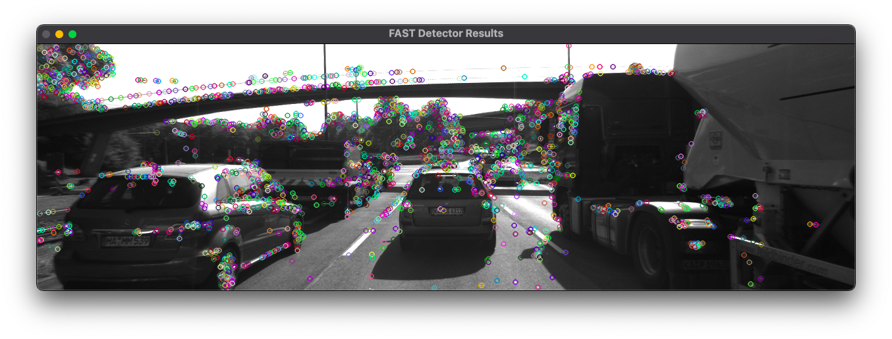
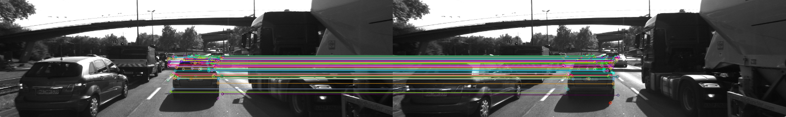
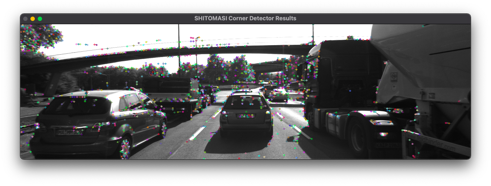
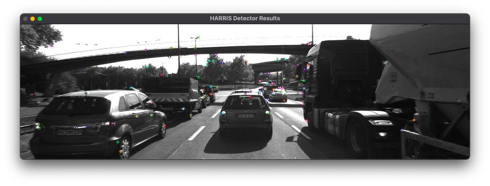
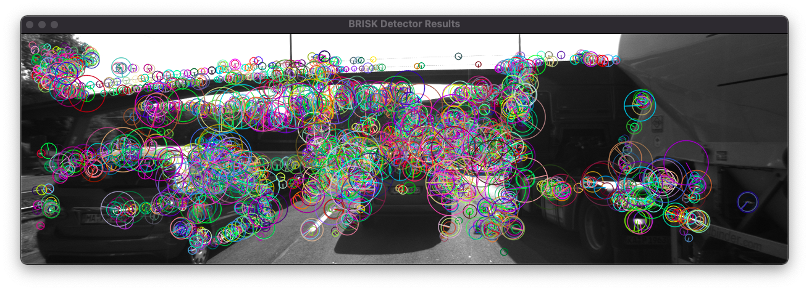
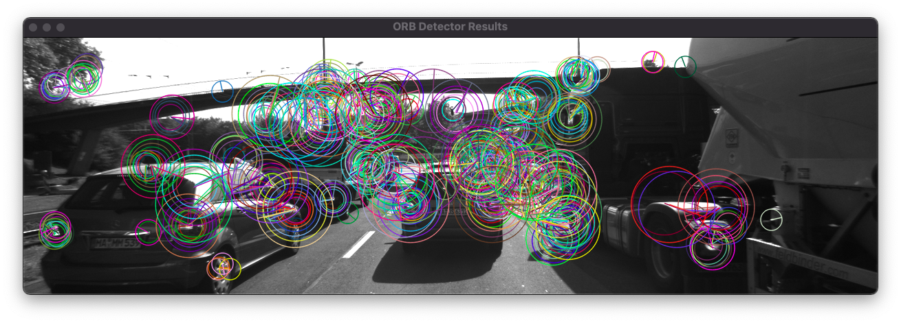
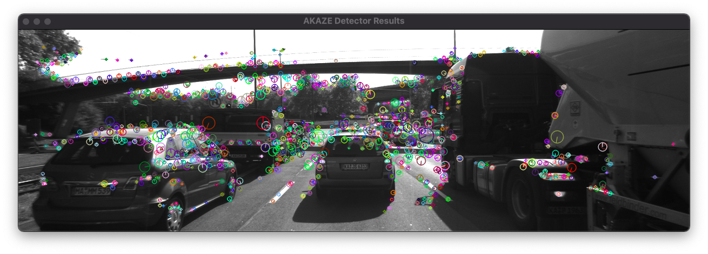
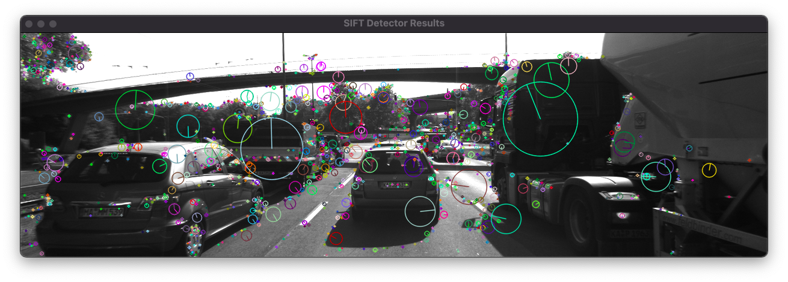

# SFND 2D Feature Tracking



**This project implement preceding vehicle freature tracking system based on OpenCV and tested on a set of consucutive images recording from camera.**

The project consists of four parts :

1. Load image, set up data structure and put everything into a ring buffer to optimize memory load. 
2. Implement several keypoint detectors
3. Implement several descriptor extraction and descriptor matching process use brute force or FLANN approach
4. Test different combination of detector and descriptor and compare them with regard to performance like number of features, feature diversity, speed,..., etc. 





**The file directory of this project : **

```
SFND_P2_2D_Feature_Matching
|- src
|  |- dataStructures.h            # define data structure for image/keypoint/descriptor/descriptor match
|  |- matching2D.cpp              # implement funcs for keypoint/descriptor/descriptor match
|  |- matching2D.hpp              
|  |- cameraFeatureTracking.cpp   # Main file for this project
|- images
|- LICENSE
|- README.md
|- CMakeLists.txt
```

- `cameraFeatureTracking.cpp` implements the full pipeline of feature tracking system
- `matching2D.cpp` implements functions of keypoint detector, descriptor, descriptor matching ,...
- `dataStructures.h` defines data structure for image, keypoint detector, descriptor and descriptor matching


## Instructions

1. Clone this repo.
2. Make a build directory in the top level directory: `mkdir build && cd build`
3. Compile: `cmake .. && make`
4. Run it: `./2D_feature_tracking` `detectorType` `descriptorType` `matcherType` `selectorType` `bVis` `bLimitKpts` `bFocusOnvehicle` 

- The supported arguments are listed below :

| Arguments       | Values Supported                                             | Meaning                                                      |
| --------------- | ------------------------------------------------------------ | ------------------------------------------------------------ |
| detectorType    | SHITOMASI, HARRIS, FAST, BRISK, ORB, AKAZE, SIFT (default = SHITOMASI) | detector type supported                                      |
| descriptorType  | BRISK, BRIEF, ORB, FREAK, AKAZE, SIFT (default = BRISK)      | descriptor type supported                                    |
| matcherType     | MAT_BF, MAT_FLANN (default = MAT_BF)                         | matching method for descriptors, brute force (BF) or FLANN   |
| selectorType    | SEL_NN, SEL_KNN (default = SEL_NN)                           | selector type for descriptors, nearest neighborhood (NN) or k nearest neighborhood (KNN) |
| bVis            | 0, 1 (default = 1)                                           | 1 for visualizing result                                     |
| bLimitKpts      | 0, 1 (default = 0)                                           | 1 for limiting keypoints below 50 points                     |
| bFocusOnVehicle | 0, 1 (default = 1)                                           | 1 for only keeping results within preceding vehicle region   |

- For example : `./2D_feature_tracking` `FAST` `ORB` `MAT_BF` `SEL_KNN` `1` `0` `1` means use FAST detector, ORB descriptor, brute force matching, KNN selector, visualizing result, not limiting keypoints below 50 points, and only keeping results within preceding vehicle region.


### Performance Evaluation 1

In this section, we'll count the number of keypoints on the preceding vehicle for all 10 images and discuss the distribution of their neighborhood size.


**Number of keypoints counted over all 10 images : **

|  Detector  | Img 1 | Img 2 | Img 3 | Img 4 | Img 5 | Img 6 | Img 7 | Img 8 | Img 9 | Img 10 |
| :--------: | :---: | :---: | :---: | :---: | :---: | :---: | :---: | :---: | :---: | :----: |
| Shi-Tomasi |  125  |  118  |  123  |  120  |  120  |  113  |  114  |  123  |  111  |  112   |
|   Harris   |  15   |  13   |  16   |  14   |  21   |  32   |  14   |  27   |  21   |   23   |
|    FAST    |  149  |  152  |  150  |  155  |  149  |  149  |  156  |  150  |  138  |  143   |
|   BRISK    |  264  |  282  |  282  |  277  |  297  |  279  |  289  |  272  |  266  |  254   |
|    ORB     |  92   |  102  |  106  |  113  |  109  |  125  |  130  |  129  |  127  |  128   |
|   AKAZE    |  166  |  157  |  161  |  155  |  163  |  164  |  173  |  175  |  177  |  179   |
|    SIFT    |  138  |  132  |  124  |  137  |  134  |  140  |  137  |  148  |  159  |  137   |


**Shi-Tomasi**

- A lot of sparse keypoints spread are detected not only in vehicle region but tree region and bridge region



**Harris**

- Compared to Shi-Tomasi, few sparse keypoints are detected and it seems that only very strong keypoints are detected
- The sparsity may result from non-maximum suppresion (NMS). It could be further tweaked in NMS setting



**FAST**

- Compared to Shi-Tomasi and Harris, much more keypoints are detected in tree and bridge region
- The parameters can be further tweaked instead of default FAST setting


**BRISK**

- BRISK has a good spread of distributed keypoints with different sizes 
- However, there're too many noisy keypoints with large sizes and lots of them spread on bridge region and tree region



**ORB**

- ORB generates keypoints mostly on vehicle region and road region
- But the keypoint neighborhood size are quite large and similar



**AKAZE**

- AKAZE generates a good spread of distributed keypoints with different sizes like BRISK
- However, it has smaller neighborhood size compared to BRISK



**SIFT**

- SIFT also has a good spread of distributed keypoints with different sizes like BRISK and AKAZE
- Besides, it has a good spread of neighborhood sizes 



### Performance Evaluation 2

In this section, we'll count the number of matched keypoints for all 10 images using all possible combinations of detectors and descriptors. In the matching step, the BF approach is used with the descriptor distance ratio set to 0.8. KNN is used with K=2.


**Number of matched pairs for successive images for 10 images: **

| Detector\Descriptor | **BRISK**                                   | **BRIEF**                                   | **ORB**                                     | **FREAK**                                   | **AKAZE**                                   | **SIFT**                                    |
| ------------------- | ------------------------------------------- | ------------------------------------------- | ------------------------------------------- | ------------------------------------------- | ------------------------------------------- | ------------------------------------------- |
| **Shi-Tomasi**      | 95, 88, 80, 90, 82, 79, 85, 86, 82          | 115, 111, 104, 101, 102, 102, 100, 109, 100 | 104, 103, 100, 102, 103, 98, 98, 102, 97    | 90, 88, 87, 89, 83, 78, 81, 86, 84          | n.a.                                        | 112, 109, 104, 103, 99, 101, 96, 106, 97    |
| **Harris**          | 10, 8, 7, 10, 16, 12, 13, 18, 17            | 11, 11, 11, 13, 19, 19, 14, 21, 17          | 12, 11, 10, 13, 20, 13, 14, 19, 17          | 11, 10, 8, 11, 16, 18, 12, 18, 16           | n.a.                                        | 11, 11, 11, 13, 21, 15, 13, 22, 18          |
| **FAST**            | 97, 104, 101, 98, 85, 107, 107, 100, 100    | 119, 130, 118, 126, 108, 123, 131, 125, 119 | 122, 122, 115, 129, 107, 120, 126, 122, 118 | 97, 98, 94, 99, 88, 99, 104, 99, 103        | n.a.                                        | 118, 123, 110, 119, 114, 119, 123, 117, 103 |
| **BRISK**           | 171, 176, 157, 176, 174, 188, 173, 171, 184 | 178, 205, 185, 179, 183, 195, 207, 189, 183 | 160, 171, 157, 170, 154, 180, 171, 175, 172 | 160, 178, 156, 173, 160, 183, 169, 179, 168 | n.a.                                        | 182, 193, 169, 183, 171, 195, 194, 176, 183 |
| **ORB**             | 73, 74, 79, 85, 79, 92, 90, 88, 91          | 49, 43, 45, 59, 53, 78, 68, 84, 66          | 65, 69, 71, 85, 91, 101, 95, 93, 91         | 42, 36, 45, 47, 44, 51, 52, 49, 55          | n.a.                                        | 67, 79, 78, 79, 82, 95, 95, 94, 94          |
| **AKAZE**           | n.a.                                        | n.a.                                        | n.a.                                        | n.a.                                        | 138, 138, 133, 127, 129, 146, 147, 151, 150 | n.a.                                        |
| **SIFT**            | 64, 66, 62, 66, 59, 64, 64, 67, 80          | 86, 78, 76, 85, 69, 74, 76, 70, 88          | Out of memory                               | 64, 72, 65, 66, 63, 58, 64, 65, 79          | n.a.                                        | 82, 81, 85, 93, 90, 81, 82, 102, 104        |


**Total number of matched pairs : **

| Detector\Descriptor | **BRISK** | **BRIEF** | **ORB**       | **FREAK** | **AKAZE** | **SIFT** |
| ------------------- | --------- | --------- | ------------- | --------- | --------- | -------- |
| **Shi-Tomasi**      | 767       | 944       | 907           | 766       | n.a.      | 927      |
| **Harris**          | 111       | 136       | 129           | 120       | n.a.      | 135      |
| **FAST**            | 899       | 1099      | 1081          | 881       | n.a.      | 1046     |
| **BRISK**           | 1570      | 1704      | 1510          | 1526      | n.a.      | 1646     |
| **ORB**             | 751       | 545       | 761           | 421       | n.a.      | 763      |
| **AKAZE**           | n.a.      | n.a.      | n.a.          | n.a.      | 1259      | n.a.     |
| **SIFT**            | 592       | 702       | Out of memory | 596       | n.a.      | 800      |


### Performance Evaluation 3

In this section, we'll log the time it takes for keypoint detection and descriptor extraction and propose the TOP3 detector / descriptor combinations must be recommended as the best choice for our purpose of detecting keypoints on vehicles.


**Average detector time \ Average descriptor time (ms) :  **

| Detector\Descriptor | **BRISK**        | **BRIEF**   | **ORB**       | **FREAK**    | **AKAZE**   | **SIFT**     |
| ------------------- | ---------------- | ----------- | ------------- | ------------ | ----------- | ------------ |
| **Shi-Tomasi**      | 11.2 ms \ 1.9 ms | 12.3 \ 1.4  | 12.0 \ 3.2    | 11.7 \ 23.1  | n.a.        | 12.0 \ 18.3  |
| **Harris**          | 987.6 \ 0.9      | 989.4 \ 0.7 | 991.4 \ 2.8   | 988.2 \ 20.7 | n.a.        | 986.5 \ 16.1 |
| **FAST**            | 1.0 \ 2.2        | 1.1 \ 1.0   | 1.1 \ 3.2     | 1.1 \ 23.3   | n.a.        | 1.0 \ 21.4   |
| **BRISK**           | 198.1 \ 3.1      | 200.0 \ 1.0 | 200.4 \ 9.6   | 200.2 \ 25.4 | n.a.        | 219.0 \ 49.3 |
| **ORB**             | 7.2 \ 1.5        | 8.2 \ 0.8   | 8.2 \ 11.1    | 7.8 \ 21.9   | n.a.        | 7.3 \ 48.8   |
| **AKAZE**           | n.a.             | n.a.        | n.a.          | n.a.         | 83.9 \ 74.3 | n.a.         |
| **SIFT**            | 148.8 \ 2.9      | 151.5 \ 1.9 | Out of memory | 131.1 \ 26.7 | n.a.        | 128.1 \ 85.5 |


Because our purpose is detecting keypoints on preceding vehicle, real time (<16.7ms for 60Hz camera capture rate), sufficient amount and spread of descriptors are most important factors to be considered. Based on above information, the following TOP3 detector / descriptor combinations are recommended :

| Detector\Descriptor | Total number of matched pairs | Time (ms) |
| ------------------- | ----------------------------- | --------- |
| **FAST + BRIEF**    | 1099                          | 2.1       |
| **FAST + BRISK**    | 899                           | 3.2       |
| **FAST + ORB**      | 1081                          | 4.3       |


## Dependencies for Running Locally

* cmake >= 2.8
  * All OSes: [click here for installation instructions](https://cmake.org/install/)
* make >= 4.1 (Linux, Mac), 3.81 (Windows)
  * Linux: make is installed by default on most Linux distros
  * Mac: [install Xcode command line tools to get make](https://developer.apple.com/xcode/features/)
  * Windows: [Click here for installation instructions](http://gnuwin32.sourceforge.net/packages/make.htm)
* OpenCV >= 4.1
  * This must be compiled from source using the `-D OPENCV_ENABLE_NONFREE=ON` cmake flag for testing the SIFT and SURF detectors.
  * The OpenCV 4.1.0 source code can be found [here](https://github.com/opencv/opencv/tree/4.1.0)
* gcc/g++ >= 5.4
  * Linux: gcc / g++ is installed by default on most Linux distros
  * Mac: same deal as make - [install Xcode command line tools](https://developer.apple.com/xcode/features/)
  * Windows: recommend using [MinGW](http://www.mingw.org/)
